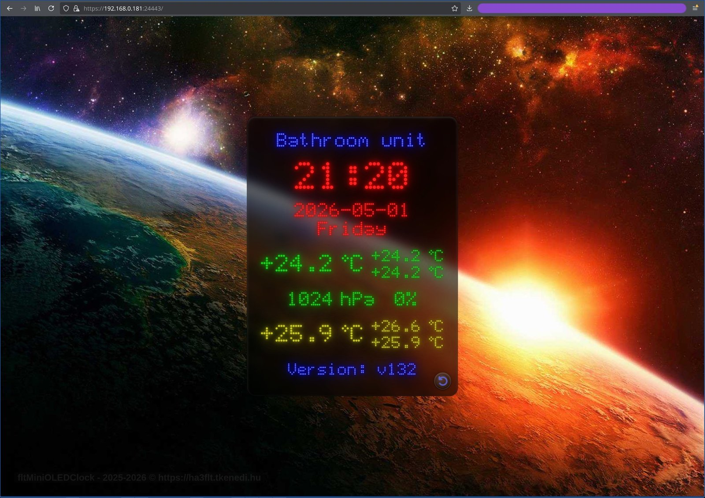
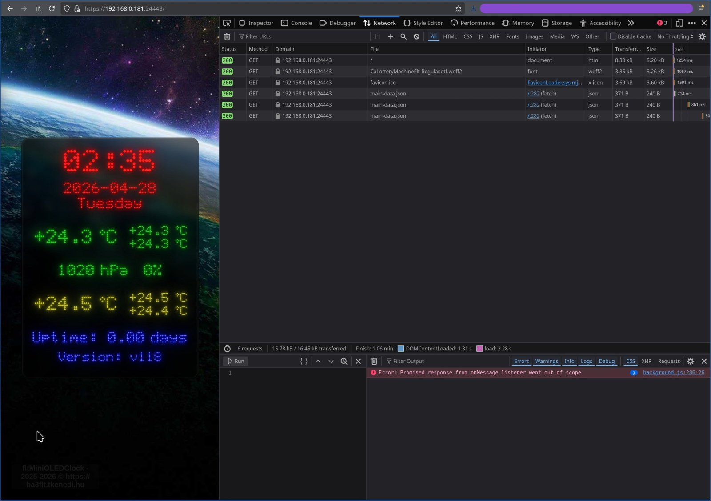
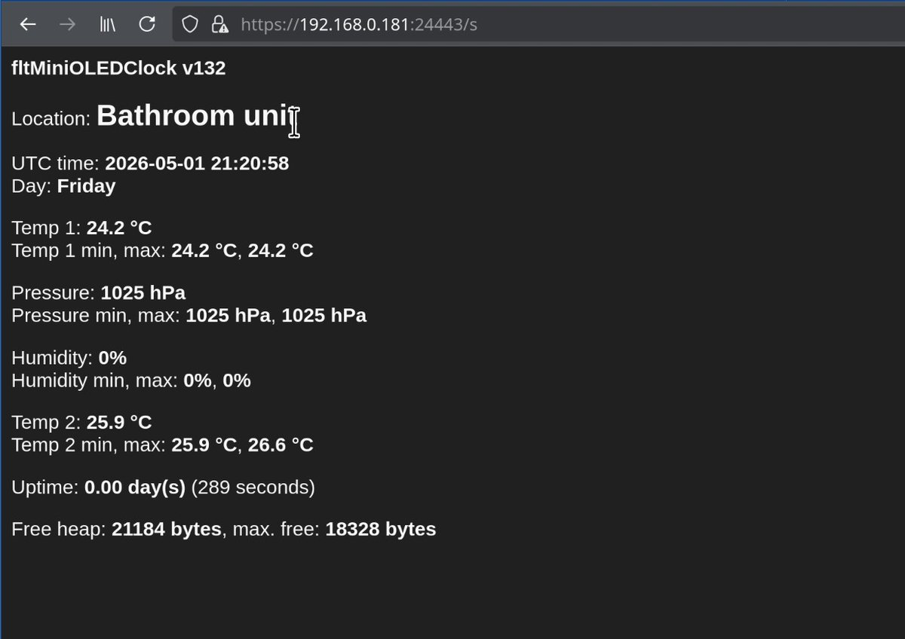
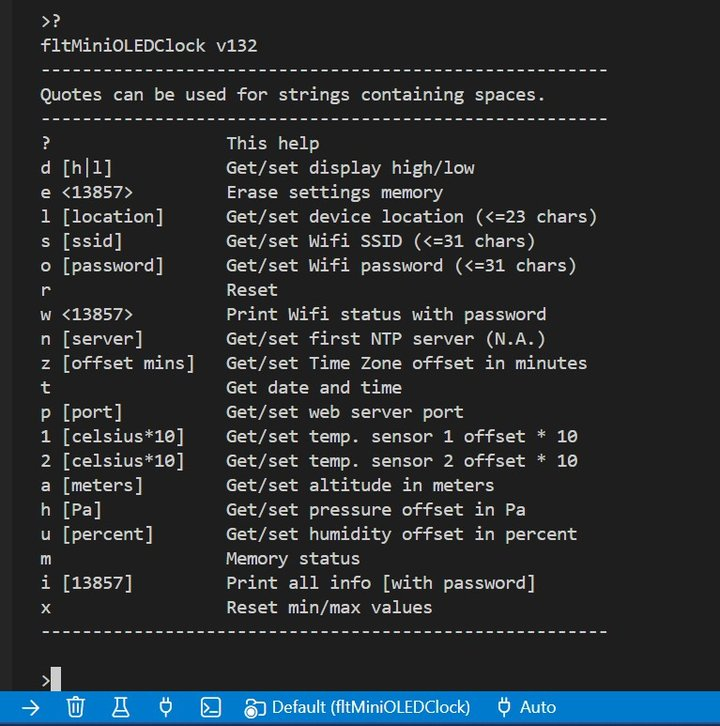
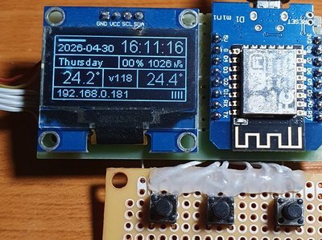

# fltMiniOLEDClock

ESP8266-based mini OLED clock and sensor station with a local display, a serial control interface, and a periodically refreshing embedded HTTPS dashboard page in front of a nice background image.

These C/C++, HTML, CSS, etc. codes are created manually yet, and is neither generated nor Vibe-coded.

## Features









<p>The WeMos D1 Mini test board (in a slightly tarnished shape from the frequent touching...):</p>


- Embedded HTTPS server with dynamic dashboard data.
- JSON endpoint for periodic browser-side refresh.
- Serial command shell for runtime controls and diagnostics.
- Two-button input handling with debounce and short/long press combinations.
- Real-time clock synchronized from NTP servers.
- SH1106 128x64 OLED dashboard with date/time, sensor data, and Wi-Fi status.
- Two temperature channels:
  - BMP085 temperature reading,
  - DS18B20 external 1-Wire temperature reading (external sensor).
- Sea-level corrected pressure calculation with altitude support.
- Min/max tracking for temperature values.
- PlatformIO project configuration for WeMos D1 Mini.

## Technology Stack

- MCU: ESP8266 (WeMos D1 Mini)
- Framework: Arduino
- Build system: PlatformIO
- Language: C++
- Display library: thingpulse/ESP8266 and ESP32 OLED driver for SSD1306 displays
- Sensor libraries:
  - adafruit/Adafruit BMP085 Library
  - milesburton/DallasTemperature
  - OneWire
- Time library: paulstoffregen/Time
- Networking/security: ESP8266WiFi + BearSSL (`WiFiServerSecure`)

## Hardware Requirements

- 1x WeMos D1 Mini (ESP8266)
- 1x SH1106 I2C OLED display (128x64, address `0x3C`)
- 1x BMP085 pressure/temperature sensor
- 1x DS18B20 temperature sensor
- 2x momentary buttons
- 3.3V power source suitable for ESP8266

## Wiring (Current Pin Mapping)

| WeMos D1 Mini pin | Function |
| --- | --- |
| 3V3 | Sensor/display VCC |
| GND | Ground |
| D3 (GPIO0) | Button 1 |
| D4 (GPIO2) | Built-in LED |
| D2 (GPIO4) | I2C SDA |
| D1 (GPIO5) | I2C SCL |
| D5 (GPIO14) | DS18B20 (1-Wire) |
| D8 (GPIO15) | Button 2 |

## Project Structure

- `src/`: Firmware source files.
- `include/`: Project headers and embedded web asset headers.
- `info_nocomp/`: Non-compiled source assets (HTML/fonts/images/certs).
- `test/`: PlatformIO test scaffolding.
- `platformio.ini`: Build environments and dependencies.

## Configuration

### 1) Wi-Fi Credentials

Create or update `include/fltWifiConfig.h`.

The repository includes `include/fltWifiConfig.h.txt` as a template.

Expected format:

```cpp
#ifndef STASSID
 #define STASSID    "YOUR_WIFI_SSID"
 #define STAPSK     "YOUR_WIFI_PASSWORD"
#endif
```

### 2) Build Flags

`platformio.ini` currently defines:

- `FMOC_VERSION_NUMBER`: A simple version number, only one integer value.
- `FMOC_DEBUG_WEB_SERVER`: Turn it on for some additional console information.
- `FMOC_HTTPS_SERVER_PORT`: The default HTTPS web server port.
- `FMOC_DEFAULT_DEVICE_LOCATION`: Name of the location where the device will be put.
- `FMOC_TIME_ZONE_OFFSET_MINS`: Offset in minutes according to the actual time zone.
- `FMOC_SENSORS_UPDATES_INTERVAL_SEC`: The sensors aren't continuously interrogated.
- `FMOC_DEFAULT_ALTITUDE_METERS`: Altitude for the pressure calibration.
- `FMOC_MEASURED_RAW_PA`: Per-device pressure calibration value.
- `FMOC_REFERENCE_SEA_LEVEL_PA`: Per-device pressure calibration value.

Customize them according to your environment

### 3) Network and Time Defaults

- HTTPS server port constant: `24443`.
- NTP server list and timezone are currently defined in `src/fltCTimeManager.cpp`.

### 4) Sensor Calibration

Altitude and pressure offset is read from the stored settings at startup. Adjust these values for your location and sensor.

## Build and Upload

From the project root:

```bash
pio run -e wemos_d1_mini
pio run -e wemos_d1_mini -t upload
```

Start serial monitor:

```bash
pio device monitor -b 115200
```

## Usage

### OLED and Buttons

Current button actions in firmware:

- Button 0 short press: help message.
- Button 0 long press: reset pressure and humidity min/max values.
- Button 1 short press: display temperature min/max values.
- Button 1 long press: reset temperature min/max values.
- Both buttons short press: toggle display brightness.
- Both buttons long press: reset non-volatile settings to defaults.

### Web Interface

After boot and Wi-Fi connection, open:

- `https://<device-ip>:<port>/`

There is only one interactive element on the page: a button in the bottom right corner of the dashboard that resets the memorized minimum and maximum values of the sensors when pushed.

If the route is not recognized, a simple page displaying the available sensor data will be shown instead of a 404 error page. See the list of valid routes below.

Additional routes:

- `/main-data.json` dynamic sensor/time JSON
- `/clearminmax.json` resets the min/max. values
- `/favicon.ico` please change it to yours...
- `/bkgnd-planets-1.jpg` background picture
- `/CaLotteryMachineFlt-Regular.otf.woff2` a customized matrix font

Note: the HTTPS certificate is embedded and self-signed, so browsers will show a security warning.

### Serial Commands

At 115200 baud, type `?` to print command help.

Available commands:

| Command | Description |
| --- | --- |
| ? | This help |
| d [h|l] | Get/set display high/low |
| e <13857> | Erase settings memory |
| l [location] | Get/set device location (<=23 chars) |
| s [ssid] | Get/set Wifi SSID (<=31 chars) |
| o [password] | Get/set Wifi password (<=31 chars) |
| r | Reset |
| w <13857> | Print Wifi status with password |
| n [server] | Get/set first NTP server (N.A.) |
| z [offset mins] | Get/set Time Zone offset in minutes |
| t | Get date and time |
| p [port] | Get/set web server port |
| 1 [celsius*10] | Get/set temp. sensor 1 offset |
| 2 [celsius*10] | Get/set temp. sensor 2 offset |
| a [meters] | Get/set altitude in meters |
| h [Pa] | Get/set pressure offset in Pa |
| u [percent*10] | Get/set humidity offset in percent |
| m | Memory status |
| i [13857] | Print all info [with password] |
| x | Reset min/max values |

Quotes can be used for strings containing spaces. Yes/no questions have been avoided for now.

## Known Limitations

- Humidity is currently a placeholder value in the sensor module.
- Menu module exists as a scaffold and is not fully implemented.
- NTP list is still a compile-time constant.

## Roadmap Ideas

- Use the watchdog to make the device work safer (the maximal 8 seconds is way too short for this single-threaded Arduino solution without some compromise).
- Add the battery indicator (top left side, above the date).
- Complete menu-driven on-device configuration.
- Add robust error handling for missing sensors and Wi-Fi reconnect cases.
- Add automated tests for core parsing and utility logic.

## License

GNU GENERAL PUBLIC LICENSE Version 3

---

Created by **HA3FLT**
